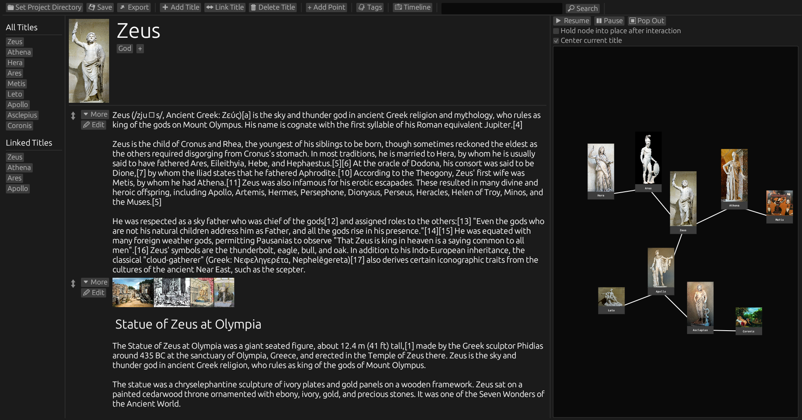

## Structurer is a program to easily organize your notes and images.

  

## Structurer uses: 
* Titles *(Pages to describe an entity, think of a wikipedia article)* 
* Points *(Fields containing data, think of a paragraph in a wikipedia article)*

# Features:
* Interactive Node View
* Link Titles to other Titles
* Add tags to Titles and filter by any combination of tags
* Add lots of images to each Point and have easy access to each of them
* Every image can have it's own description and data
* Add a date and time to each Point
* Show Points in a chronological order (Timeline)
* Search through the content of all Points across Titles
* Share Points between Titles, changing the Point from a Title updates it across all Titles is has been shared with
* Basic text formatting
* Reorder Titles and Points

## Installation:
    Clone the repository
    Navigate to the Structurer folder and run: cargo build --release 
    An executable is created in Structurer/target/release

## Removing the app:
    Delete the cloned repo
    Delete the Structurer folder in your config directory. 
    You can find the config directory based on your Operating System [here](https://docs.rs/dirs/latest/dirs/fn.config_dir.html).
